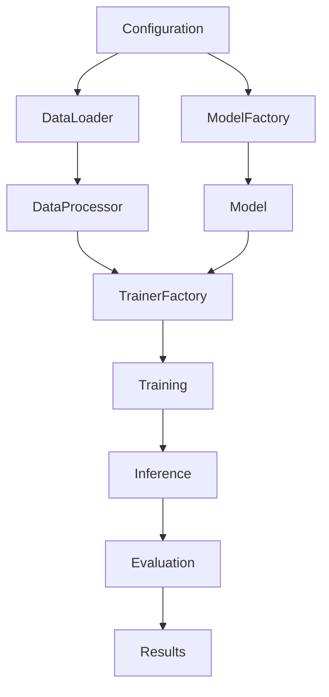

# Towards Vietnamese Legal Question Answering: An Empirical Study [paper]

An Unified Framework for Fine-tuning and Instruction Fine-tuning Question Answering for Vietnamese Legal Text

<div align="center">


[](https://arxiv.org/abs/your-paper-id)

**A comprehensive framework for training and evaluating Abstractive Question Answering models on Vietnamese legal texts**

[🚀 Quick Start](#-quick-start) • [📖 Documentation](#-documentation) • [🎯 Features](#-features) • [📊 Results](#-results) • [🤝 Contributing](#-contributing)

</div>

---

## 🎯 Features

### **🏗️ Comprehensive Architecture**
- **Stage-wise execution**: Train, infer, and evaluate independently or end-to-end
- **Multi-model support**: PLMs (ViT5, BARTPho) and LLMs (Qwen2, SeaLLM, VinaLLaMA)
- **Training methods**: Traditional fine-tuning and instruction fine-tuning
- **Advanced techniques**: QLoRA, Parameter-Efficient Fine-Tuning (PEFT)

### **🔧 Professional Development**
- **Modular design**: Clean separation of concerns with factory patterns
- **Configuration-driven**: YAML configs with CLI overrides
- **Research-ready**: Reproducible experiments with seed control
- **Production-grade**: Comprehensive logging, error handling, and testing

### **📊 Evaluation Suite**
- **Multiple metrics**: ROUGE, BLEU, METEOR, BERTScore
- **Vietnamese-optimized**: Specialized preprocessing for Vietnamese text
- **Detailed analysis**: Per-sample results and aggregate statistics
- **Export capabilities**: CSV, JSON results for further analysis

---

## 🚀 Quick Start

### **Installation**

```bash
# Clone the repository
git clone https://github.com/preview4r/ViLegalQA.git
cd ViLegalQA

# Install dependencies
pip install -r requirements.txt

# Or install as package
pip install -e .
```

### **Basic Usage**

```bash
# 🔥 Fine-tune ViT5 (End-to-End)
python scripts/run_aqa.py \
    --model_name VietAI/vit5-base \
    --training_method finetune \
    --do_end2end \
    --output_dir ./outputs/vit5_finetune

# 🧠 Instruction-tune Qwen2 (End-to-End)
python scripts/run_aqa.py \
    --model_name Qwen/Qwen2-7B-Instruct \
    --training_method instruct \
    --model_type llm \
    --do_end2end \
    --output_dir ./outputs/qwen2_instruct

# 📊 Stage-wise execution for long training (Kaggle-friendly)
python scripts/run_aqa.py --config configs/examples/vit5_finetune.yaml --do_finetune
python scripts/run_aqa.py --checkpoint_path ./outputs/model --do_infer  
python scripts/run_aqa.py --results_file ./outputs/results.csv --do_eval
```

### **Using Configuration Files**

```bash
# Create custom config based on examples
cp configs/examples/vit5_finetune.yaml my_config.yaml

# Edit parameters as needed, then run
python scripts/run_aqa.py --config my_config.yaml --do_end2end
```

---

## 📁 Project Structure

```
ViBidLQA-AQA/
├── 📄 README.md                    # This file
├── 📄 requirements.txt             # Dependencies  
├── 📄 setup.py                     # Package setup
├── 📄 pyproject.toml              # Modern Python config
├── 📁 configs/                     # Configuration files
│   ├── 📄 base_config.py          # Base configuration class
│   ├── 📁 model_configs/          # Model-specific configs
│   ├── 📁 training_configs/       # Training-specific configs
│   └── 📁 examples/               # Example YAML configs
├── 📁 src/                        # Source code
│   ├── 📁 data/                   # Data loading and processing
│   ├── 📁 models/                 # Model implementations
│   ├── 📁 training/               # Training pipelines
│   ├── 📁 inference/              # Inference engines
│   ├── 📁 evaluation/             # Evaluation metrics
│   └── 📁 utils/                  # Utility functions
├── 📁 scripts/                    # Executable scripts
│   ├── 📄 run_aqa.py             # Main entry point
│   └── 📁 examples/              # Example shell scripts
├── 📁 experiments/               # Experiment outputs
└── 📁 tests/                     # Unit tests
```

---

## 🎛️ Configuration

### **Model Types & Training Methods**

| Model Type | Models | Training Method | Use Case |
|------------|--------|-----------------|----------|
| **PLM** | ViT5, BARTPho | Fine-tuning | Traditional seq2seq training |
| **PLM** | ViT5, BARTPho | Instruction | Instruction-aware training |
| **LLM** | Qwen2, SeaLLM, VinaLLaMA | Instruction | QLoRA + instruction tuning |

### **Example Configurations**

<details>
<summary><b>📝 ViT5 Fine-tuning (configs/examples/vit5_finetune.yaml)</b></summary>

```yaml
# Model Configuration
model_name: "VietAI/vit5-base"
model_type: "plm"
training_method: "finetune"

# Training Parameters
num_train_epochs: 5
per_device_train_batch_size: 2
per_device_eval_batch_size: 4
learning_rate: 3e-5
warmup_ratio: 0.05
weight_decay: 0.01

# PLM Specific
max_source_length: 1024
max_target_length: 256
predict_with_generate: true

# Dataset
dataset_name: "preview/ViBidLQA"
data_split_mode: "auto"
train_ratio: 0.8
val_ratio: 0.1
test_ratio: 0.1

# Output
output_dir: "./outputs/vit5_finetune"
logging_steps: 100
eval_steps: 500
save_steps: 500
```

</details>

<details>
<summary><b>🧠 Qwen2 Instruction Tuning (configs/examples/qwen2_instruct.yaml)</b></summary>

```yaml
# Model Configuration
model_name: "Qwen/Qwen2-7B-Instruct"
model_type: "llm"
training_method: "instruct"

# Training Parameters
num_train_epochs: 3
per_device_train_batch_size: 1
gradient_accumulation_steps: 2
learning_rate: 1e-5
warmup_ratio: 0.03

# QLoRA Configuration
use_qlora: true
load_in_4bit: true
lora_r: 16
lora_alpha: 32
lora_dropout: 0.05
lora_target_modules: ["up_proj", "down_proj", "gate_proj", "k_proj", "q_proj", "v_proj", "o_proj"]

# LLM Specific
max_seq_length: 2048
packing: true
dataset_text_field: "instruction"

# Output
output_dir: "./outputs/qwen2_instruct"
```

</details>

### **Command Line Interface**

```bash
# ===== STAGE CONTROL =====
--do_finetune          # Run training stage only
--do_infer             # Run inference stage only  
--do_eval              # Run evaluation stage only
--do_end2end           # Run all stages sequentially

# ===== MODEL CONFIGURATION =====
--model_name MODEL     # Model name/path (e.g., VietAI/vit5-base)
--model_type TYPE      # plm or llm
--training_method METHOD # finetune or instruct

# ===== TRAINING PARAMETERS =====
--num_train_epochs N   # Number of training epochs
--learning_rate LR     # Learning rate
--batch_size BS        # Training batch size

# ===== LLM SPECIFIC (QLoRA) =====
--lora_r R             # LoRA rank
--lora_alpha ALPHA     # LoRA alpha
--lora_dropout DROPOUT # LoRA dropout

# ===== DATA =====
--dataset_name NAME    # HuggingFace dataset name
--data_split_mode MODE # auto or predefined
--train_ratio RATIO    # Training split ratio (0.8)

# ===== PATHS =====
--config CONFIG        # YAML config file path
--output_dir DIR       # Output directory
--checkpoint_path PATH # Model checkpoint (for inference)
--results_file FILE    # Results CSV (for evaluation)

# ===== UTILITIES =====
--validate_only        # Validate config without running
--show_info           # Show pipeline information
--show_recommendations # Show training recommendations
```

---

## 📊 Results

### **Model Performance on ViBidLQA Dataset**

| Model | Method | ROUGE-1 | ROUGE-2 | ROUGE-L | ROUGE-L-SUM | BLEU-1 | BLEU-2 | BLEU-3 | BLEU-4 | METEOR | BERT-Score-F1 |
|-------|--------|---------|---------|---------|-------------|--------|--------|--------|--------|--------|---------------|
| BARTPho-base | Finetuning | 70.58 | 56.53 | 59.91 | 59.94 | 47.16 | 40.62 | 36.41 | 32.58 | 57.21 | 84.55 |
| ViT5-base | Finetuning | 75.09 | 63.43 | 65.72 | 65.79 | 53.61 | 47.51 | 43.40 | 39.54 | 64.38 | 86.65 |
| BARTPho-base | Instruction | 65.45 | 45.32 | 50.78 | 50.81 | 38.22 | 30.32 | 25.91 | 22.36 | 47.34 | 80.59 |
| ViT5-base | Instruction | 74.69 | 61.30 | 64.21 | 64.23 | 52.90 | 46.49 | 42.37 | 38.70 | 62.67 | 86.04 |
| Qwen2-0.5B | Instruction | 64.82 | 51.02 | 53.58 | 54.35 | 43.32 | 36.57 | 32.32 | 28.56 | 57.20 | 81.52 |
| Qwen2.5-0.5B | Instruction | 60.83 | 43.12 | 47.33 | 48.04 | 36.63 | 28.98 | 24.43 | 20.62 | 50.96 | 79.16 |
| Qwen2-0.5B-Instruct | Instruction | 65.73 | 49.41 | 52.21 | 53.11 | 42.73 | 35.48 | 30.93 | 27.04 | 56.15 | 80.55 |
| Qwen2.5-0.5B-Instruct | Instruction | 63.63 | 45.18 | 48.89 | 49.73 | 37.96 | 30.00 | 25.17 | 21.19 | 49.63 | 79.85 |
| SeaLLMs-v3-1.5B | Instruction | 72.31 | 61.61 | 62.56 | 63.24 | 52.87 | 46.41 | 41.88 | 37.69 | 63.77 | 85.75 |
| Qwen2-1.5B | Instruction | 72.41 | 61.43 | 62.54 | 63.28 | 53.14 | 46.64 | 42.09 | 37.86 | 64.84 | 85.65 |
| Qwen2.5-1.5B | Instruction | 70.64 | 59.31 | 60.35 | 61.05 | 50.80 | 44.33 | 39.88 | 35.77 | 63.01 | 84.73 |
| SeaLLMs-v3-1.5B-Chat | Instruction | 73.18 | 62.90 | 63.81 | 64.42 | 53.97 | 47.87 | 43.58 | 39.54 | 64.99 | 86.09 |
| Qwen2-1.5B-Instruct | Instruction | 69.99 | 58.60 | 60.19 | 60.92 | 48.78 | 42.56 | 38.21 | 34.11 | 62.15 | 84.17 |
| Qwen2.5-1.5B-Instruct | Instruction | 69.31 | 54.97 | 56.49 | 57.27 | 46.12 | 38.90 | 34.23 | 30.04 | 60.11 | 82.36 |
| VinaLlama-2.7B | Instruction | 73.52 | 61.74 | 63.23 | 64.11 | 53.43 | 46.92 | 42.48 | 38.37 | 66.61 | 85.71 |
| VinaLlama-2.7B-Chat | Instruction | 61.33 | 32.03 | 40.18 | 41.88 | 24.55 | 10.32 | 4.98 | 2.64 | 38.59 | 75.64 |
| Qwen2.5-3B | Instruction | 54.34 | 43.88 | 45.25 | 46.07 | 34.84 | 29.27 | 25.82 | 22.60 | 59.89 | 79.32 |
| Qwen2.5-3B-Instruct | Instruction | 67.10 | 54.48 | 55.78 | 56.59 | 46.62 | 39.70 | 35.17 | 31.03 | 66.23 | 83.10 |
| VinaLlama-7B | Instruction | 74.42 | 62.03 | 63.27 | 65.76 | 54.91 | 48.38 | 43.15 | 38.62 | 67.12 | 85.97 |
| VinaLlama-7B-chat | Instruction | 64.73 | 35.82 | 44.19 | 45.56 | 27.73 | 12.28 | 6.06 | 3.29 | 41.88 | 76.92 |
| SeaLLMs-v3-7B | Instruction | 74.03 | 63.89 | 64.54 | 65.20 | 54.80 | 48.80 | 44.41 | 40.34 | 68.77 | 85.57 |
| Qwen2-7B | Instruction | 74.93 | 65.65 | 66.11 | 66.69 | 56.05 | 50.20 | 45.88 | 41.88 | 68.14 | 86.51 |
| Qwen2.5-7B | Instruction | 76.31 | 68.42 | 69.31 | 69.15 | 58.41 | 54.37 | 49.38 | 46.15 | 71.79 | 87.17 |
| SeaLLMs-v3-7B-Chat | Instruction | 73.17 | 62.21 | 62.76 | 63.45 | 53.96 | 47.08 | 42.26 | 37.88 | 68.42 | 85.61 |
| Qwen2-7B-Instruct | Instruction | 73.78 | 62.53 | 62.83 | 63.67 | 54.31 | 47.80 | 43.11 | 38.79 | 69.16 | 85.15 |
| Qwen2.5-7B-Instruct | Instruction | 75.64 | 66.39 | 67.07 | 67.62 | 57.99 | 52.25 | 48.06 | 44.07 | 70.75 | 86.83 |

### **Training Efficiency**

| Model | Parameters | Training Time | GPU Memory | Technique |
|-------|------------|---------------|------------|-----------|
| ViT5-base | 223M | 2.5h | 8GB | Standard FT |
| Qwen2-7B | 7.6B | 11h | 16GB | QLoRA (4-bit) |
| SeaLLM-v3-7B | 7.6B | 11h | 16GB | QLoRA (4-bit) |

---

## 🛠️ Advanced Usage

### **Custom Model Implementation**

```python
from src.models.base_model import BaseAQAModel

class CustomModel(BaseAQAModel):
    def load_model(self):
        # Implement model loading
        pass
    
    def prepare_for_training(self):
        # Implement training preparation
        pass
    
    def generate(self, inputs, **kwargs):
        # Implement generation logic
        pass
```

### **Custom Evaluation Metrics**

```python
from src.evaluation.metrics import register_metric

@register_metric("custom_metric")
def custom_evaluation(predictions, references):
    # Implement custom metric
    return {"custom_score": score}
```

### **Kaggle Workflow**

```bash
# Stage 1: Training (≤12 hours)
python scripts/run_aqa.py --config config.yaml --do_finetune

# Stage 2: Inference (≤12 hours)  
python scripts/run_aqa.py --checkpoint_path ./outputs/model --do_infer

# Stage 3: Evaluation (≤12 hours)
python scripts/run_aqa.py --results_file ./outputs/results.csv --do_eval
```

---

## 🏗️ Architecture Details

### **Design Principles**

1. **Modularity**: Clean separation between data, models, training, and evaluation
2. **Extensibility**: Easy to add new models, metrics, and training methods
3. **Configuration-Driven**: All parameters configurable via YAML/CLI
4. **Research-Ready**: Reproducible experiments with comprehensive logging
5. **Production-Grade**: Error handling, validation, and testing

### **Key Components**

- **ConfigFactory**: Dynamic configuration creation based on model type and training method
- **ModelFactory**: Unified interface for creating PLM and LLM models
- **TrainerFactory**: Automatic trainer selection (Seq2SeqTrainer vs SFTTrainer)
- **DataProcessor**: Flexible data processing with instruction templates
- **Evaluator**: Comprehensive evaluation with multiple metrics

### **Flow Diagram**



---

## 🧪 Testing

```bash
# Run all tests
pytest tests/

# Run specific test categories
pytest tests/ -m "unit"          # Unit tests only
pytest tests/ -m "integration"   # Integration tests only
pytest tests/ -m "not slow"      # Skip slow tests

# Run with coverage
pytest tests/ --cov=src --cov-report=html
```

---

## 🤝 Contributing

We welcome contributions! Please see our [Contributing Guidelines](CONTRIBUTING.md) for details.

### **Development Setup**

```bash
# Install development dependencies
pip install -e ".[dev]"

# Set up pre-commit hooks
pre-commit install

# Run code formatting
black src/ configs/ scripts/
isort src/ configs/ scripts/

# Type checking
mypy src/ configs/
```

### **Contribution Areas**

- 🐛 **Bug fixes** and performance improvements
- 🔧 **New model implementations** (PLMs/LLMs)
- 📊 **Additional evaluation metrics**
- 📖 **Documentation improvements**
- 🧪 **Test coverage expansion**

---

## 📝 Citation

Coming soon...

---

## 📄 License

This project is licensed under the MIT License - see the [LICENSE](LICENSE) file for details.

---

## 🙏 Acknowledgments

- **ViBidLQA Dataset**: Curated from Vietnamese bidding law documents
- **Hugging Face**: For the transformers library and model hosting
- **Vietnamese NLP Community**: For tools like underthesea and pyvi
- **Research Community**: For open-source models and evaluation metrics

---

## 📞 Contact

- **Author**: Anonymous
- **Email**: anoymous@gmail.com
- **GitHub**: [preview4r](https://github.com/preview4r)
- **Issues**: [GitHub Issues](https://github.com/preview4r/ViLegalQA/issues)

---

<div align="center">

**🌟 Star this repository if you find it helpful! 🌟**

[](https://github.com/preview4r/ViLegalQA/stargazers)

</div>


